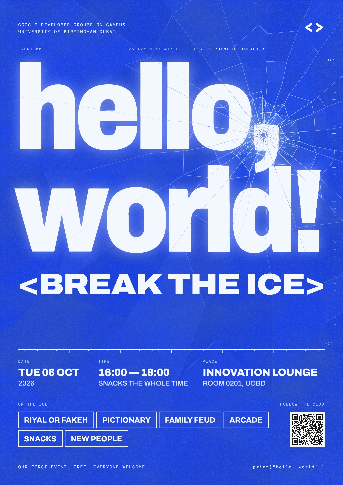

# Blue Ice: the look of hello, world!

The brand rules for **hello, world!**, the first event of GDG on Campus UOBD, written down so anyone on the team (or an AI assistant) can make a post, a slide, a screen or a page that matches the poster.

- **Live brand sheet:** [`hello-world/index.html`](index.html) shows every rule with working examples.
- **Code:** `blue-ice.css` (tokens, fonts, components) and `blue-ice.js` (`window.BlueIce`: Wordmark, Button, Tag, FactGrid, Ruler, Annotation).
- **This look is for this event only.** Everything else the club makes follows the main `design/DESIGN.md`.

---

Blue Ice is the look of **hello, world!**, the first event of Google Developer Groups on Campus, University of Birmingham Dubai. It is an icebreaker, so the whole identity is one idea: **a sheet of cobalt ice, struck once, breaking into a room full of people.** Use this book for the posters, the event website, the screens in the room and the reel.

The event: Tue 06 Oct 2026, 16:00 to 18:00, room 0201 Innovation Lounge, UOBD. Riyal or Fakeh, Pictionary, Family Feud, arcade stalls, snacks the whole time. Free, everyone welcome.



## The idea in three moves

1. **One blue, used as a material.** The ground is `cobalt`, flat and heavy like riso ink or a cyanotype. White is the light inside the ice (`frost`), never a second colour.
2. **Struck once.** Every hero layout has exactly one point of impact. Cracks run out from it in straight rays and close in broken rings, and the pieces drift apart by a few pixels. The impact sits on something that means something: on the poster it is the comma in *hello, world!*, the pause before you say hi.
3. **Labelled like a field study.** Small spaced mono labels (`label` style) name what you are looking at: `EVENT 001`, `FIG. 1  POINT OF IMPACT`, a temperature scale from −18° to +22°. The room warms up as the event goes on.

## Content fundamentals

- **Voice:** short, warm, a little dry. We talk to students as *you* and about the club as *we*. Jokes come from the ice idea, never at anyone's expense: `ON THE ICE`, `<BREAK THE ICE>`, `<THE ICE IS BROKEN>`.
- **Casing:** everything is in capitals except two things. The event name is always lowercase with its punctuation, exactly `hello, world!`, because it is a line of code. Running text on the website (`body`) is in sentence case.
- **Brackets:** the club's code brackets survive from the main brand. The one display line on a layout sits inside `< >`: `<BREAK THE ICE>`, `<SEE YOU THERE>`, `<ROUND 2>`.
- **Code as a sign-off:** a footer may end with `print("hello, world!")` in `mono`.
- **Facts are terse:** `TUE 06 OCT`, `16:00 — 18:00`, `INNOVATION LOUNGE`. Use the 24-hour clock and an em dash between times. Name the place by its name and put the room number on the second line: `ROOM 0201, UOBD`.
- **No emoji** anywhere, on posters, the site or captions.

## Colour

- About **85% `cobalt`, 13% `frost`, 2% everything else.** The sheet is the poster.
- On the Ice theme, set text in `text` (frost), secondary lines in `text-soft`, labels in `label`. Every pair is 4.5:1 or better on `ground`; `rime` is the faintest blue allowed for text.
- `bloom` is light, not ink: only for the glow behind the wordmark and at the point of impact.
- The **Frost** theme (paper ground, cobalt ink) is for the website's long pages, forms, printed handouts and anything read up close. Posters, screens and the hero are always Ice.
- Brand colours from the main club identity (Google red, yellow, green) **do not appear** in Blue Ice, with one exception: the colour bracket mark may appear small on Frost when the club needs to be recognised outside the event.
- `alert` is the only warm colour and only ever marks an error, always with words.

## Type

- **Archivo** (variable, widths 62–125%) for everything people read. **DM Mono** for labels, header and footer lines, code.
- `wordmark`: the event name, Archivo 900 at font-stretch **82%**, tracking −5%, leading 0.86, sized so its widest line fills the measure exactly. Lowercase. One per layout.
- `display`: the bracketed line, Archivo 900 at font-stretch **112%**, fitted to the measure.
- `info` for facts, `tag` inside outlined tags, `body` for running text, `label` above every fact.
- The jump in scale between `wordmark` and `label` is the point: giant ice, tiny field notes. Don't fill the middle sizes with extra text.
- Set digits with `font-variant-numeric: tabular-nums` wherever they line up.

## The fracture

The signature graphic is generated, not drawn. Use `BlueIce.Wordmark()` from `blue-ice.js`, or follow its rules by hand:

- **One impact point**, on a meaningful glyph (the comma, the `!`, the `0` of `001`).
- **24 radial rays** at slightly irregular angles; **rings** at roughly 16, 38, 70, 115, 178, 262, 380, 545 and 780px from the impact, each jittered ±18%.
- Rings **break up** as they travel: complete near the impact, 40% present at 380px, gone by 1100px. Rays run out at different lengths.
- The three innermost rings are **split once more** into triangles: the crushed centre.
- Shards **drift outward**, about 6.5px at the impact, falling off to under 1px at the edges, with a tiny rotation. The text inside a shard moves with it.
- Lines are `crack`, 1.6px at the impact thinning to 0.7px, fading to about 12% at the edge.
- Shard fills vary only in lightness (`cobalt` to `shard`), never in hue.

## Texture and light

- A **fine mineral grain** sits over the whole sheet at about 16% (screen blend). It should be felt more than seen; if you can see it from a metre away it is too strong.
- A slow **mottle** in deeper cobalt drifts across the ground, like uneven ink or thick ice.
- The wordmark carries a **frost glow** (`frost-glow`): a 22px blurred copy of itself at about 40% under the sharp letters. The edges of the letters stay razor-sharp.
- No gradients as decoration, no drop shadows, no chrome, no 3D. The only depth is light passing through ice.

## Layout

- Posters are A-series portrait, built on a **1200 × 1697** sheet with a **64px margin** (`sheet-margin`). Scale everything with the sheet.
- Top to bottom: a mono header (club name left, bracket mark right), a hairline, a label row; the **wordmark** as large as the measure allows; the **display** line; then the facts, anchored to the bottom: the measuring rule, a three-column fact grid, the tags and QR, a hairline, the mono footer.
- The space between the display line and the facts is **left for the fracture to breathe**. Don't fill it.
- Corners are square (`radius-none`) everywhere. Only the impact ring and leader dots are round.
- On a 16:9 screen the wordmark sits on the left two-thirds and the facts stack on the right third; the impact point stays on the comma.

## Iconography and marks

- The **GDG bracket mark** (Logos) appears in one colour: `gdg-mark-frost.svg` on Ice, `gdg-mark-cobalt.svg` on Frost. The four-colour original stays in the main club brand.
- There is **no icon set**. Information is carried by words and labels. If a website control needs a glyph, use a plain typographic one in DM Mono: `→`, `↗`, `×`, `+`.
- Arrows and leader lines are 1.2px `rule` strokes ending in a 2.5px dot.

## Imagery

- Photography from the event goes **cobalt duotone**: shadows `cobalt-deep`, highlights `frost`. No colour photos on Ice layouts.
- Reference mood (from the club's Pinterest board, blue pins only): riso-printed festival lineups on cobalt, cyanotype blurs, frosted glowing letterforms, a popsicle melting on black, shattered-glass type, blurred spray-paint lettering, embossed blue paper, a highlighted Stedelijk wordmark, monospace clock faces. Take the *materials* from them, never their layouts.

## Motion

- One moment only: on the website the wordmark arrives whole, then **cracks** from the impact outward (rings first, then the shards drift) over about 900ms, ease-out. Nothing loops.
- Under `prefers-reduced-motion`, show the cracked state at once.

## Don't

- Don't add a second hue to make it "fun". Fun comes from the crack and the jokes.
- Don't put more than one impact on a layout, or an impact in empty space.
- Don't round corners or soften the outlines.
- Don't set the event name in capitals or without its comma and `!`.
- Don't use the four-colour Google palette on Ice.


---

## Token reference

### Colour (`{name}` means "same as that token")

| Token | Ice | Frost | Use |
|---|---|---|---|
| `cobalt` | `#1E3FD9` | `#1E3FD9` | THE brand colour. The ice sheet: every poster ground, the website hero, the frost theme's accent. Never tinted, never paired with another hue at the same size. |
| `cobalt-deep` | `#0A1B66` | `#0A1B66` | Deepest ice. Text on frost, the page behind a poster in a mockup, the bottom of the mottled sheet. |
| `cobalt-edge` | `#142FB0` | `#142FB0` | A raised or sunken panel on the cobalt sheet (a footer band, a code block). Text on it uses the same text tokens as the sheet. |
| `frost` | `#F3F8FF` | `#F3F8FF` | The white of the ice. Wordmark, display type, button fills, the QR tile. Never pure #FFFFFF: frost is always a touch blue. |
| `glacier` | `#CFE0FF` | `#CFE0FF` | Secondary text and hairlines on cobalt (5.7:1 on cobalt). |
| `rime` | `#B8CEFF` | `#B8CEFF` | Mono labels and annotations on cobalt (4.8:1 on cobalt). The lightest blue that still passes for 13px text. |
| `bloom` | `#7FB2FF` | `#7FB2FF` | The frost glow behind the wordmark and the light at the point of impact. Decoration only, never text. |
| `ground` | `{cobalt}` | `{frost}` | Page and poster background. |
| `ground-raised` | `{cobalt-edge}` | `#E2EBFF` | Panels, code blocks and bands that sit on `ground`. |
| `shard` | `#244AE0` | `#E9F0FF` | The lighter facet of a broken sheet. Fill for alternate shards, hover on a tile. |
| `text` | `{frost}` | `{cobalt-deep}` | Headlines and body copy on `ground` and `ground-raised` (7.1:1 ice, 14.5:1 frost). |
| `text-soft` | `{glacier}` | `#2B3E99` | Second lines, captions and secondary info on `ground` (5.7:1 ice, 8.7:1 frost). |
| `label` | `{rime}` | `#3D52B0` | Spaced mono labels (DATE, FIG. 1, EVENT 001) on `ground` (4.8:1 ice, 6.5:1 frost). |
| `line` | `#DCE8FF8C` | `#1E3FD966` | Hairlines: the header rule, the footer rule, dividers. 1px only. |
| `rule` | `{frost}` | `{cobalt}` | The 2px measuring rule above the info grid, outlined tags, the impact ring. Meets 3:1 on `ground` in both themes. |
| `crack` | `#EAF2FF` | `{cobalt}` | Fracture lines. Drawn at full strength near the point of impact and fading outward. |
| `accent` | `{frost}` | `{cobalt}` | Primary button fill, the QR tile, the one solid shape on a layout. |
| `on-accent` | `{cobalt}` | `{frost}` | Text and icons on `accent` (7.1:1 both themes). |
| `focus` | `{frost}` | `{cobalt}` | Keyboard focus ring: 2px solid, 3px offset. 7:1 on `ground` in both themes. |
| `alert` | `#FFC2B8` | `#B3261E` | Form errors only, always with a word (THAT NAME IS TAKEN.). 4.9:1 ice, 6.1:1 frost. The only warm colour in the system and it never decorates. |

### Type

Archivo is the variable file in `kit/fonts/`; use `font-variation-settings: "wdth" 82` for the wordmark and `"wdth" 112` for the bracketed line. DM Mono is in `hello-world/fonts/`.

| Style | Font | Size | Weight | Tracking | Leading | Use |
|---|---|---|---|---|---|---|
| `wordmark` | Archivo | 260px | 900 | -0.05em | 0.86 | The event name only, always lowercase, font-stretch 82%, fitted edge to edge of the measure and struck once. One per layout. |
| `display` | Archivo | 96px | 900 | -0.02em | 0.95 | The bracketed line. Caps, font-stretch 112%, fitted to the measure. Always inside < >. |
| `headline` | Archivo | 56px | 900 | -0.03em | 1 | Section heads on the website and on screens. Caps, font-stretch 90%. |
| `info` | Archivo | 36px | 800 | -0.01em | 1.1 | The facts: date, time, room. Caps. |
| `tag` | Archivo | 26px | 700 | 0.02em | 1 | Text inside an outlined Tag. Caps. |
| `body` | Archivo | 17px | 500 | 0.01em | 1.5 | Running text on the website. Sentence case is allowed here and only here. 65 characters a line at most. |
| `label` | DM Mono | 13px | 400 | 0.2em | 1.4 | Specimen labels above facts and figures. Caps, `label` colour. |
| `mono` | DM Mono | 15px | 400 | 0.16em | 1.6 | Header and footer lines, the club name, code (print("hello, world!")). |
| `micro` | DM Mono | 12px | 400 | 0.18em | 1.3 | Scale readings on a ruler. Never for anything people must read. |

### Spacing, radius, stroke, glow

| Token | Value | Use |
|---|---|---|
| `space-1` | `8px` | Gap between tags; label to its value. |
| `space-2` | `16px` | Phone gutter; inner padding of small controls. |
| `space-3` | `24px` | Between lines of a fact block; tag side padding (20px on posters). |
| `space-4` | `32px` | Rule to the first label; card padding. |
| `space-6` | `48px` | Between blocks inside a section. |
| `sheet-margin` | `64px` | Poster margin on a 1200px-wide sheet (5.33% of the width). Website gutter at desktop widths. |
| `radius-none` | `0` | Everything: tags, buttons, the QR tile, panels. Ice breaks with corners. |
| `radius-hair` | `2px` | Only inputs on the website, so the field reads as touchable. |
| `radius-round` | `50%` | The impact ring and the dot at the end of a leader line. Nothing else is round. |
| `stroke-hair` | `1px` | Header and footer rules, ruler ticks, leader lines (1.2px on posters). |
| `stroke-rule` | `2px` | The measuring rule, tag outlines, button outlines. |
| `stroke-crack` | `1.6px` | Fracture lines at the point of impact; they thin to 0.7px at the edge of the sheet. |
| `frost-glow` | `0 0 44px 0 rgba(191, 214, 255, 0.45)` | The breath on a window. The glow behind the wordmark (as a blurred copy or text-shadow) and around the QR tile. Never a drop shadow: nothing in this system casts a shadow downward. |

---

## Poster recipe

How to make the next Blue Ice poster, a story, or a screen, from the first poster's grid.

### Sheet

- Build on **1200 × 1697** (A-series portrait). Export at 2× (2400 × 3394) for print, a JPG for Instagram.
- Margin `sheet-margin` (64px) on all sides. The measure is 1072px.
- Ground `cobalt`, mottle in `cobalt-deep`, grain at 16%, `bloom` light centred on the point of impact.

### Top to bottom

| y (px) | element | style |
| --- | --- | --- |
| 92 / 116 | club name on two lines, left; bracket mark (`gdg-mark-frost.svg`, 74px wide) right | `mono` in `text-soft` |
| 146 | hairline across the measure | `line`, 1px |
| 176 | label row: `EVENT 001` left, coordinates `25.12° N  55.41° E` centre, `FIG. 1  POINT OF IMPACT` ending just left of the leader | `label` |
| 214 → | the **Wordmark**, widest line fitted to 1072px, two lines, leading 0.86 | `wordmark` |
| below | the bracketed line fitted to the measure | `display` |
| bottom-anchored | the **FactGrid** (ruler, DATE, TIME, PLACE) | `info`, `label`, `text-soft` |
| bottom-anchored | `ON THE ICE` + Tags left; `FOLLOW THE CLUB` + the QR tile right, tops aligned | `tag`, `label` |
| 1639 | hairline, then the footer: `OUR FIRST EVENT.  FREE.  EVERYONE WELCOME.` left, `print("hello, world!")` right | `mono` |

- The temperature **Ruler** runs vertically down the right edge, 26px from the edge, from the top of the wordmark to just above the facts, `−18°` to `+22°` in `micro`.
- The QR tile is `accent` with a 7px quiet zone and is exactly as tall as two rows of tags.

### A series

Keep the grid and the seed. Change one thing per poster:

- **Countdown:** the bracketed line becomes `<3 DAYS>`, `<TOMORROW>`, `<TODAY, 16:00>`.
- **Per activity:** the wordmark stays; the bracketed line names the game (`<RIYAL OR FAKEH>`) and its Tag is the only one shown, now solid `accent` with `on-accent` text.
- **After:** a cobalt duotone photo replaces the sheet below the wordmark; the bracketed line is `<THE ICE IS BROKEN>`.

### Instagram

- Post (4:5, 1080 × 1350): wordmark, bracketed line, the three facts. No tags, no QR (the link is in the bio).
- Story (9:16, 1080 × 1920): the full poster grid with 24px more margin at top and bottom for the app's bars.

---

## Website

How Blue Ice works for the event page and anything the club builds for it.

### Structure

1. **Hero** on Ice: header line (club name, bracket mark), the Wordmark fitted to the page's measure, the bracketed line, then one solid Button (`<RSVP>`) and one outline Button.
2. **Facts:** the FactGrid on Ice, straight under the hero.
3. **On the ice:** one block per activity on the Frost theme: a `headline`, two or three sentences of `body`, the activity's Tag.
4. **Footer** on Ice: the socials, `print("hello, world!")`.

### Rules

- Load `tokens.css`, then `bundle.css`, then `bundle.js`. Fonts are the system's own files; never swap in a Google-hosted lookalike.
- Measure: 1072px max, gutter `sheet-margin` on desktop and `space-2` on phones.
- Set `data-theme="ice"` on dark sections and `data-theme="frost"` on reading sections. Never invent a third ground.
- Body copy is `body` on Frost, 65 characters a line at most, sentence case.
- Arrival: the Wordmark renders unbroken (`crack: false`), then swaps to the cracked version after 300ms. Under `prefers-reduced-motion`, render cracked straight away.
- Forms: inputs are 56px, 2px `rule` border, `radius-hair`, caps placeholder in `label`. Errors appear under the field in `alert` with words, in capitals: `THAT NAME IS TAKEN.`
- The party games' phone screens (Pictionary guesses, buzzers) use Ice, `label` for status, one solid Button at a time, and Tags for team names.

---

## Components (`blue-ice.js`)

Load `blue-ice.css`, then `blue-ice.js`. Every factory returns a DOM element to append.

```js
const mark = BlueIce.Wordmark({ width: 1072, bleed: true }); // the cracked name; mark.impact = {x, y}
BlueIce.Button({ label: "<RSVP>" });                        // variant: "outline" for the second action
BlueIce.Tag("PICTIONARY");                                  // wrap several in <div class="bi-tags">
BlueIce.FactGrid([{ label: "DATE", value: "TUE 06 OCT", note: "2026" }, …]); // columns 3 : 4 : 5, values never wrap
BlueIce.Ruler({ ticks: 48, every: 8 });
BlueIce.Annotation({ label: "FIG. 1  POINT OF IMPACT" });
```

Wait for the fonts before building a Wordmark (`document.fonts.load('900 100px Archivo')`), because it measures the letters to fit them.
